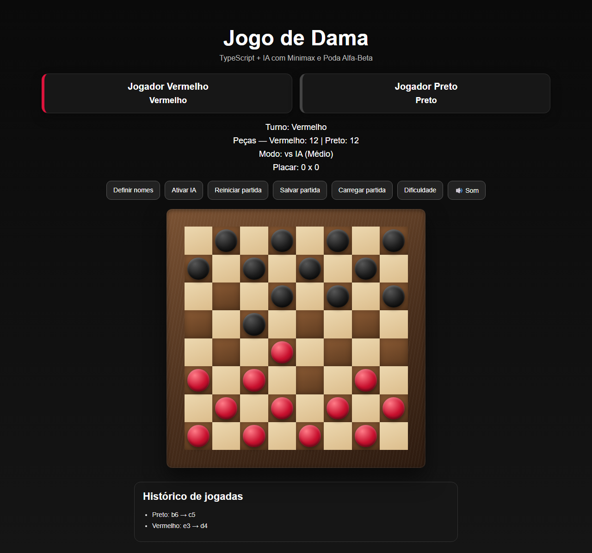

# ♟️ Jogo de Dama com IA

[](https://www.typescriptlang.org/)
[](https://vitejs.dev/)
[](https://vitest.dev/)
[](https://github.com/RobersonCodes/checkers-game/actions/workflows/ci.yml)
[](https://github.com/RobersonCodes/checkers-game/commits/main)

Um motor de damas 8x8 em **TypeScript** puro, construído do jeito que se constrói um jogo de tabuleiro de verdade: regras primeiro, IA depois, apresentação por cima — cada camada isolada da outra e testada isoladamente. Sem framework, sem engine externa: só o motor de regras, um adversário de Minimax rodando fora da thread principal, e uma camada de renderização que sabe animar sem travar.

---

## 📸 Captura de tela



---

## 📌 Funcionalidades

- Tabuleiro de dama 8x8, regras oficiais de movimentação e captura
- Captura obrigatória e **lei da maioria** (só a maior sequência de captura do lado é jogável)
- Múltiplas capturas na mesma jogada, encadeadas como um único lance atômico
- Dama voadora (movimento e captura à distância, com escolha de casa de aterrissagem)
- Promoção para dama — inclusive a regra de encerrar o lance ao promover em meio a uma captura
- **Empate automático**: 40 lances sem captura/promoção ou tripla repetição de posição
- Vitória por eliminação de peças ou por bloqueio (sem lances legais)
- Arrastar e soltar peças (Pointer Events unificando mouse e toque), com clique como alternativa
- **Totalmente jogável por teclado**: navegação por setas com roving tabindex, seleção/lance com Enter/Espaço
- Sons sintetizados via Web Audio API (sem assets externos) e vibração ao capturar
- Histórico de lances em notação de xadrez/damas (`e3 → d4`)
- Salvamento e carregamento local com validação de schema (um save corrompido nunca derruba a partida)
- Placar persistente (vitórias, derrotas e empates)
- Modal in-app para renomear jogadores (sem `window.prompt`)
- Modo 2 jogadores e modo contra IA, com 3 níveis de dificuldade

## 🧠 Inteligência Artificial

A IA joga com **Minimax + poda alfa-beta**, rodando em um **Web Worker dedicado** — a busca nunca compartilha a thread principal com a renderização, então mesmo no nível mais forte a interface continua respondendo normalmente.

| Dificuldade | Profundidade de busca |
|---|---|
| Fácil | 2 plies |
| Médio | 4 plies |
| Difícil | 6 plies |

A árvore de busca aplica cada lance **mutando o tabuleiro no lugar e desfazendo em seguida**, em vez de clonar o estado inteiro a cada nó — a técnica padrão de engines de tabuleiro para manter a busca rápida sem virar gargalo de garbage collector. A heurística de avaliação pondera material, avanço, controle de centro, ocupação da fileira de fundo e um termo de mobilidade calculado de forma barata (sem regenerar a árvore de capturas inteira a cada folha).

Cada requisição de lance é identificada por um id incremental: se o jogo for reiniciado, o modo for trocado ou uma partida for carregada enquanto a IA ainda está pensando, a resposta antiga chega, é reconhecida como obsoleta e descartada — nenhum lance fantasma vaza para o tabuleiro novo.

## 🎮 Motor de regras

O motor de regras (`src/rules.ts`) é puro — zero DOM, zero estado global — e cobre os casos que costumam quebrar implementações amadoras de dama:

- Captura obrigatória avaliada por **todas** as peças do lado, não só a selecionada
- Lei da maioria: entre todas as sequências de captura possíveis, só as de comprimento máximo são legais
- Cadeias de captura múltipla via busca em profundidade, rastreando casas já capturadas e já esvaziadas dentro da própria cadeia
- Dama voadora: varre a diagonal até a primeira peça, valida que é inimiga e gera uma ramificação de lance para cada casa de aterrissagem possível
- Promoção que encerra o lance imediatamente ao ocorrer em meio a uma captura (regra padrão de damas 8x8)
- Empate por 40 lances sem progresso ou por posição repetida 3 vezes, garantindo que toda partida chega a um estado terminal

## ♿ Acessibilidade

O tabuleiro é um `role="grid"` de verdade, não uma grade de `<div>`s decorativos:

- Cada casa expõe `aria-label` dinâmico com notação, ocupante e estado (`"d4, vazia, lance disponível"`)
- Navegação completa por teclado via *roving tabindex* — setas movem o foco, Enter/Espaço seleciona ou executa o lance
- Indicador de foco visível (`:focus-visible`) em todas as casas
- `prefers-reduced-motion` desativa as animações e os pulsos de destaque para quem pediu isso ao sistema operacional
- Captura obrigatória é sinalizada por cor **e** por forma (um selo triangular), para não depender só de matiz

## 🏗️ Arquitetura

```
checkers-game/
├── index.html
├── style.css
├── package.json
├── .github/workflows/ci.yml
├── docs/
│   └── screenshot.png
└── src/
    ├── main.ts         # wiring de eventos DOM ↔ Game ↔ render, orquestra a IA via worker
    ├── game.ts         # estado da partida, histórico, regra de empate, orquestração de turno
    ├── board.ts        # criação/clonagem de tabuleiro + aplicação de lance (mutável e imutável)
    ├── rules.ts        # motor de regras puro: lances, capturas, lei da maioria
    ├── ai.ts           # minimax + poda alfa-beta + heurística de avaliação
    ├── ai.worker.ts    # roda a IA fora da thread principal
    ├── persistence.ts  # SaveRepository — localStorage isolado atrás de uma interface testável
    ├── render.ts       # DOM, drag-and-drop, animações, ARIA
    ├── sound.ts        # efeitos sonoros sintetizados via Web Audio API
    ├── types.ts        # contratos de domínio
    └── *.test.ts       # suíte Vitest (regras, IA, persistência, jogo)
```

Cada camada só conhece a de baixo: `render.ts` não sabe o que é um "lance legal", `ai.ts` não sabe que existe um DOM, e `game.ts` não sabe *como* a IA calcula um lance — só que recebe um `Move` já pronto para aplicar. Essa separação é o que torna o motor de regras e a IA testáveis sem precisar simular um navegador.

## 🧪 Qualidade

- **Vitest** cobrindo o motor de regras, a IA, a persistência e a orquestração de partida — inclusive casos de risco como captura obrigatória, cadeias de captura, promoção em meio a captura, empate por repetição e saves corrompidos
- **CI no GitHub Actions**: todo push e PR roda typecheck (`tsc --noEmit`), a suíte de testes e o build de produção
- `SaveRepository` injetável em `Game`, permitindo testar a lógica de partida com um repositório em memória em vez de `localStorage`
- TypeScript em modo `strict`, sem `any` em nenhum arquivo-fonte

```bash
npm run dev      # servidor de desenvolvimento
npm test         # suíte de testes (Vitest)
npm run build    # typecheck + build de produção
npm run preview  # serve o build de produção localmente
```

## 🛠️ Tecnologias utilizadas

- TypeScript (modo `strict`)
- Vite
- Vitest
- Web Worker API (IA fora da thread principal)
- LocalStorage (atrás de uma camada de persistência testável)
- Web Audio API
- GitHub Actions (CI)
- Algoritmo Minimax com poda alfa-beta
